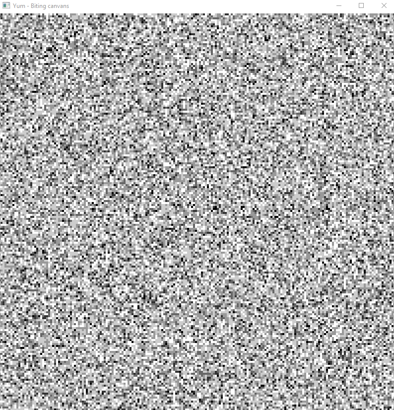
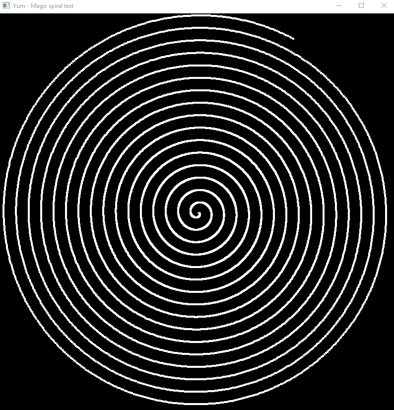

# Yum-Tests
Сборник всяких прототипов и тестов с графикой на OpenGL, написанных на C++

### biting-canvans
Отрисовывает массив пикселей. У каждого пикселя есть вес, который визуализируется цветом от черного (0) до белого (1). Раз в такт (1ms) от рандомного пикселя отнимается 0.2 веса. Таким образом холст деградирует. Постепенно холст пропадает и начинает выглядить как космос :3

### magic-spiral
Рисует спираль из пикселей и вращает ее.

